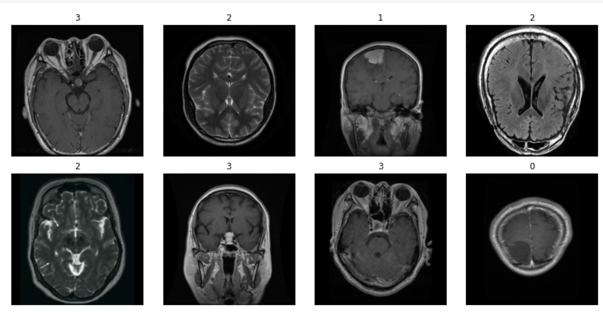
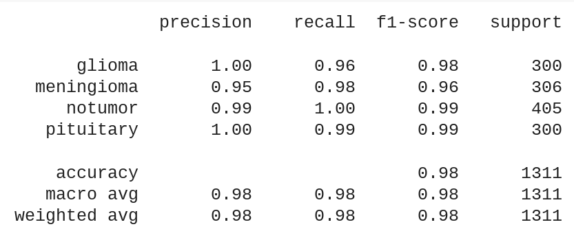

## The project is dedicated to detecting brain tumors and its classification by looking at Brain MRI Scans.

Final dataset contains 7022 images of human brain MRI images which are classified into 4 classes: glioma - meningioma - no tumor and pituitary. 

### For creating the model and improving the model's efficiency were applied the following techniques:
- Data augmentation
- Convolutional Neural Network
- Transfer learning and the model ResNet50
- FineTuning
- Learning Rate Scheduling
- Early Stopping

The result is presented as a classification report.

The project was created in Google Colab.
